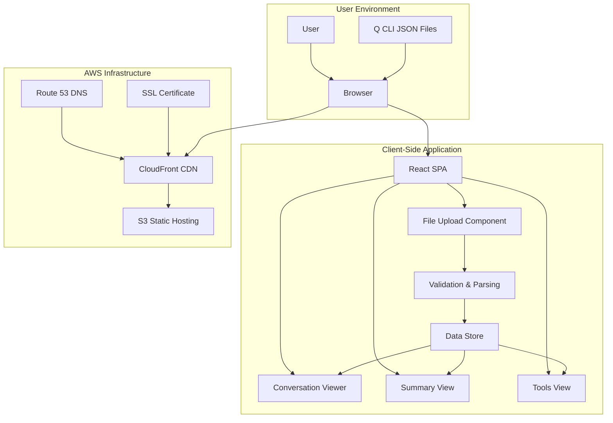
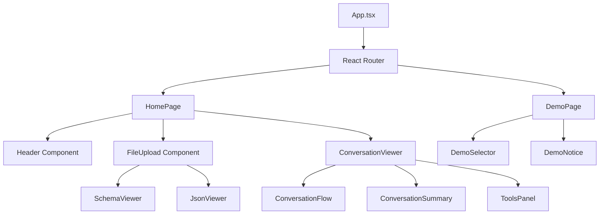
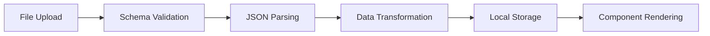
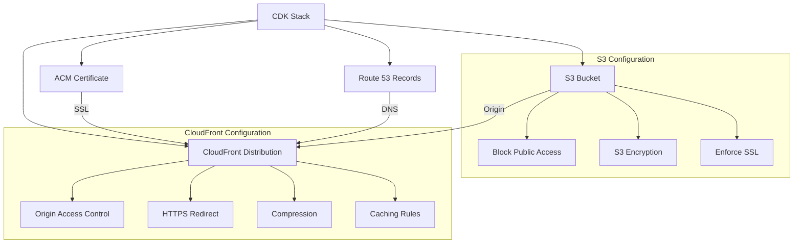
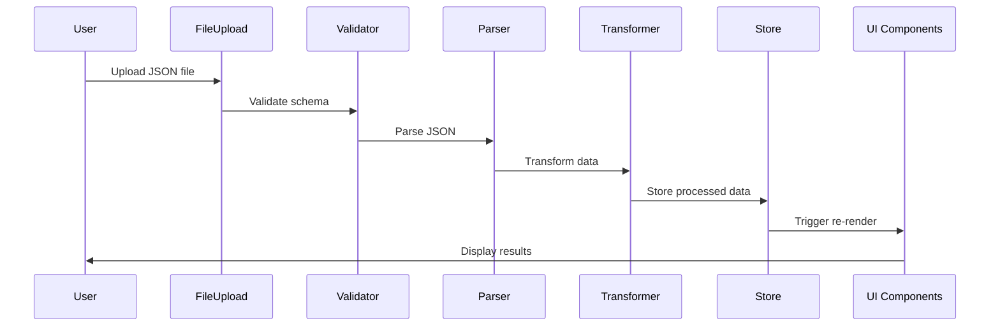
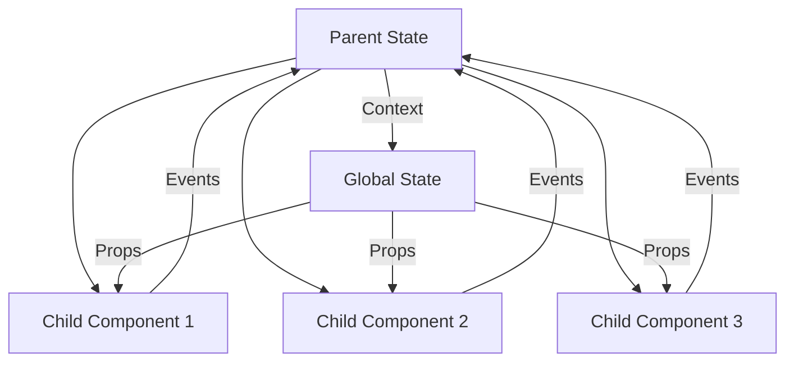
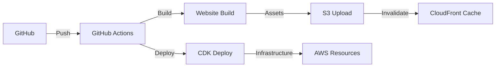

# System Architecture

## Architecture Overview

The Q CLI Conversation Viewer follows a **client-side single-page application (SPA)** architecture with a **privacy-first design**. The system is built as a monorepo with separate packages for the web application and AWS infrastructure.

## Architecture Characteristics

### Privacy & Security
- **Client-Side Processing**: All data processing occurs in the browser
- **No Data Transmission**: Files never leave the user's device
- **HTTPS Enforcement**: All traffic encrypted via CloudFront
- **No Tracking**: Zero analytics, cookies, or telemetry

### Performance
- **Static Site Generation**: Pre-built assets for fast loading
- **CDN Distribution**: Global content delivery via CloudFront
- **Lazy Loading**: Components loaded on demand
- **Efficient Parsing**: Streaming JSON processing for large files

### Scalability
- **Serverless Architecture**: No backend servers to manage
- **Global Distribution**: CloudFront edge locations worldwide
- **Auto-scaling**: S3 and CloudFront scale automatically

### Reliability
- **High Availability**: Multi-region AWS infrastructure
- **Error Boundaries**: React error handling prevents crashes
- **Graceful Degradation**: Fallbacks for unsupported features

## System Components

### Frontend Application (`packages/website`)

#### Component Architecture

#### Key Design Patterns

**1. Component Composition Pattern**
- Small, focused components with single responsibilities
- Composition over inheritance for complex UI elements
- Props-based data flow for predictable state management

**2. Container/Presenter Pattern**
- Smart components handle data and business logic
- Dumb components focus on presentation
- Clear separation of concerns

**3. State Management Pattern**
- React hooks for local component state
- Context API for shared application state
- No external state management library (keeping it simple)

**4. Error Boundary Pattern**
- Graceful error handling at component boundaries
- User-friendly error messages
- Fallback UI for broken components

### Data Processing Layer

#### File Processing Pipeline

#### Data Transformation
- **Message Normalization**: Convert various message types to unified format
- **Tool Extraction**: Parse tool specifications and usage patterns
- **Statistics Generation**: Calculate usage metrics and conversation analytics
- **Timeline Creation**: Build chronological conversation flow

### Infrastructure Layer (`packages/infrastructure`)

#### AWS CDK Stack

## Design Principles

### 1. Privacy by Design
- **Data Minimization**: Only process necessary data
- **Local Processing**: No server-side data handling
- **Transparency**: Open source for verification
- **User Control**: Users maintain complete data ownership

### 2. Progressive Enhancement
- **Core Functionality First**: Basic file viewing works without JavaScript
- **Enhanced Features**: Advanced analytics require JavaScript
- **Graceful Degradation**: Fallbacks for unsupported browsers

### 3. Component Modularity
- **Single Responsibility**: Each component has one clear purpose
- **Loose Coupling**: Components interact through well-defined interfaces
- **High Cohesion**: Related functionality grouped together
- **Reusability**: Components designed for reuse across views

### 4. Performance Optimization
- **Code Splitting**: Load only necessary code
- **Asset Optimization**: Minified and compressed resources
- **Caching Strategy**: Aggressive caching for static assets
- **Lazy Loading**: Defer non-critical resource loading

## Data Flow Architecture

### File Processing Flow

### Component Communication

## Security Architecture

### Client-Side Security
- **Input Validation**: Strict JSON schema validation
- **XSS Prevention**: React's built-in XSS protection
- **Content Security Policy**: Restrictive CSP headers
- **Secure Dependencies**: Regular dependency updates

### Infrastructure Security
- **HTTPS Only**: SSL/TLS encryption for all traffic
- **Origin Access Control**: Restrict S3 access to CloudFront
- **Security Headers**: HSTS, X-Frame-Options, etc.
- **Access Logging**: CloudFront access logs for monitoring

## Deployment Architecture

### CI/CD Pipeline

### Environment Strategy
- **Production**: Live website at qview.chat
- **Development**: Local development server
- **No Staging**: Simple two-environment approach

This architecture ensures the application meets its core requirements of privacy, performance, and usability while maintaining a simple, maintainable codebase.
