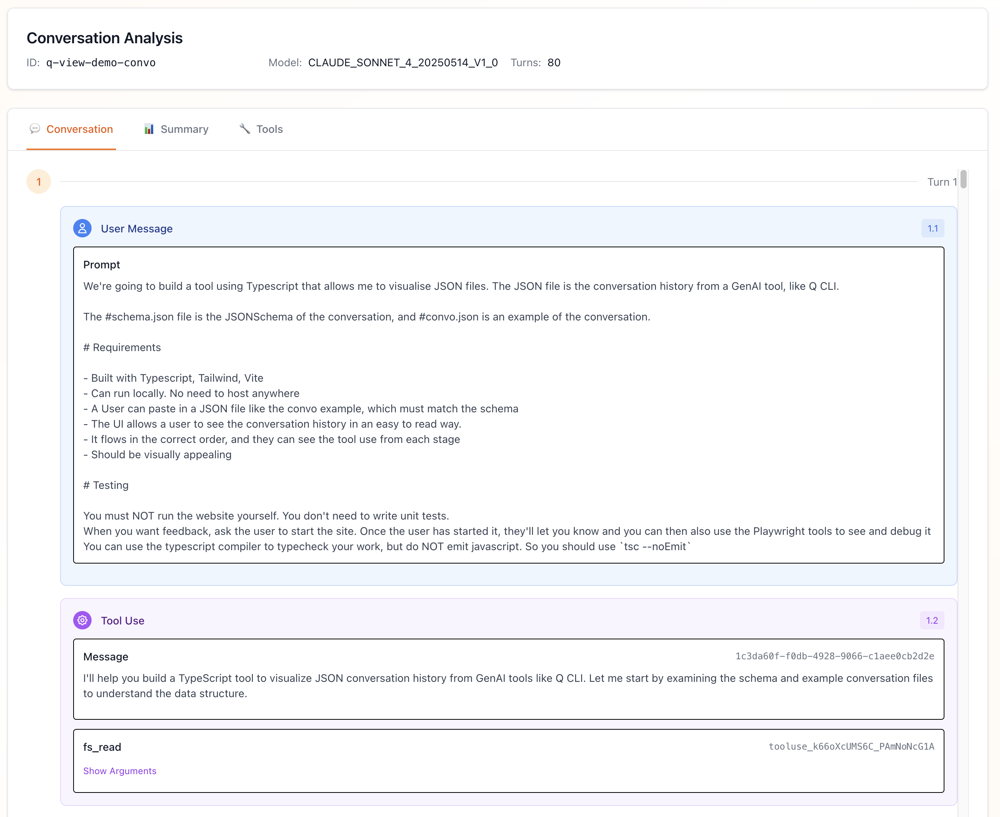
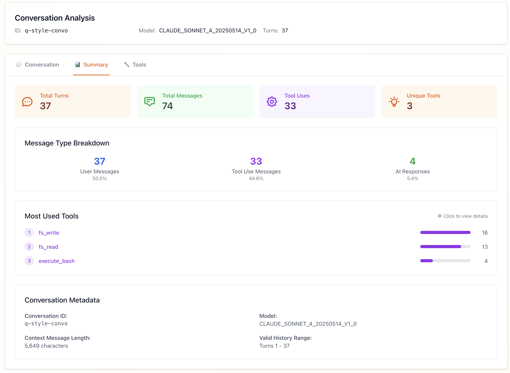

# Q CLI Conversation Viewer

**An unofficial, open-source tool for visualizing and analyzing Amazon Q Developer conversation history from Q CLI.**

[](https://opensource.org/licenses/MIT)
[](https://www.typescriptlang.org/)
[](https://reactjs.org/)
[](https://aws.amazon.com/cdk/)

🌐 **Live Demo**: [https://qview.chat](https://qview.chat)

## 📸 Screenshots

### Conversation Flow View

*Visualize the complete conversation flow with clear message type indicators and tool usage*

### Analytics Summary

*Get insights into tool usage patterns and conversation statistics*

## ⚠️ Important Disclaimers

- **Unofficial Tool**: This is an independent, community-created tool and is not affiliated with, endorsed by, or supported by Amazon Web Services (AWS) or the Amazon Q Developer team.
- **Open Source**: This project is completely open source to ensure transparency and allow users to verify that no data is transmitted to third parties.
- **Privacy First**: All conversation processing happens locally in your browser. No data leaves your device.

## 🎯 What This Tool Does

The Q CLI Conversation Viewer helps developers understand their Amazon Q Developer interactions by providing:

- **📊 Tool Usage Analytics** - See which tools Q Developer uses most frequently and understand their parameters
- **💬 Conversation Flow Visualization** - Clear visual distinction between user prompts, tool usage, and AI responses  
- **🔍 Schema Validation** - Built-in JSON schema validation for Q CLI conversation files
- **🔧 Interactive Tool Exploration** - Navigate between conversation summary and detailed tool specifications
- **📈 Usage Statistics** - Understand patterns in your Q Developer interactions

## 🔒 Privacy & Security

This tool is designed with privacy as the top priority:

- ✅ **100% Local Processing** - All conversation analysis happens in your browser
- ✅ **No Data Transmission** - Your conversation files never leave your device
- ✅ **No Cookies** - We don't use cookies or any tracking mechanisms
- ✅ **No Analytics** - No usage tracking, telemetry, or data collection
- ✅ **No Third-Party Services** - No external APIs or services are called
- ✅ **Open Source** - Full source code available for inspection and verification

## 🚀 Quick Start

### Using the Hosted Version

1. Visit [https://qview.chat](https://qview.chat)
2. Save your Q CLI conversation using the `/save` command during a chat session
3. Upload the saved JSON file to the viewer
4. Explore your conversation across three tabs:
   - **Conversation**: Message flow with visual indicators
   - **Summary**: Statistics and most-used tools
   - **Tools**: Detailed tool specifications

### Running Locally

If you prefer to run the tool locally for additional privacy assurance:

```bash
# Clone the repository
git clone https://github.com/ryancormack/q-view.git
cd q-viewer

# Install dependencies
pnpm install

# Start development server
pnpm dev

# Build for production
pnpm build
```

**Prerequisites:**
- Node.js 18+
- pnpm 8+

## 📁 Project Structure

```
├── packages/
│   ├── website/           # React frontend application
│   │   ├── src/          # React components and logic
│   │   ├── public/       # Static assets and demo files
│   │   └── package.json  # Website dependencies
│   └── infrastructure/   # AWS CDK deployment (optional)
│       ├── lib/         # CDK stack definitions
│       └── package.json # Infrastructure dependencies
├── README.md            # This file
└── package.json         # Root workspace configuration
```

## 📋 Supported File Format

The viewer expects Q CLI conversation files with this structure:

```json
{
  "conversation_id": "uuid-string",
  "history": [
    [/* array of message objects per turn */]
  ],
  "transcript": ["flat text representation"],
  "tools": {
    "namespace": [
      {
        "name": "tool_name",
        "description": "What the tool does",
        "input_schema": { /* JSON Schema */ }
      }
    ]
  },
  "model": "claude-3-5-sonnet-20241022"
}
```

## 🎨 Message Types

The viewer provides visual indicators for different message types:

- **🔵 User Messages**: Your prompts and inputs to Q Developer
- **⚫ Tool Results**: Results returned from tool execution  
- **🟣 Tool Use**: Q Developer's tool invocations with parameters
- **🟢 AI Responses**: Q Developer's text responses and explanations

## 🛠️ Development

```bash
# Install all dependencies
pnpm install

# Start development server
pnpm dev

# Build all packages
pnpm build

# Type check all packages
pnpm typecheck

# Clean all packages
pnpm clean
```

### Package-specific commands:
```bash
# Website only
pnpm --filter @q-convo-viewer/website dev
pnpm --filter @q-convo-viewer/website build

# Infrastructure only (optional)
pnpm --filter @q-convo-viewer/infrastructure deploy
```

## 🌐 Deployment (Optional)

The application can be deployed to AWS using the included CDK infrastructure:

```bash
# Deploy infrastructure (first time)
pnpm deploy:infra

# Deploy website updates
pnpm deploy:website

# Deploy both
pnpm deploy
```

**Architecture:**
- **S3** for static file hosting
- **CloudFront** for global CDN
- **Route 53** for DNS
- **ACM** for SSL certificates

## 🤝 Contributing

Contributions are welcome! This project is open source to ensure transparency and allow the community to verify its privacy claims.

1. Fork the repository
2. Create a feature branch
3. Make your changes
4. Add tests if applicable
5. Submit a pull request

## 📄 License

This project is licensed under the MIT License - see the [LICENSE](LICENSE) file for details.

## 🙋‍♂️ FAQ

**Q: Is this tool safe to use with sensitive conversations?**
A: Yes, all processing happens locally in your browser. No data is transmitted anywhere.

**Q: Why is this open source?**
A: Transparency is crucial when handling potentially sensitive developer conversations. Open source allows you to verify that no data leaves your device.

**Q: Can I run this completely offline?**
A: Yes, after building the project locally, it can run entirely offline.

**Q: Does this work with all Q CLI conversation files?**
A: It's designed to work with standard Q CLI conversation JSON files. If you encounter issues, please open an issue with details.

**Q: Is this affiliated with AWS or Amazon Q Developer?**
A: No, this is an independent, community-created tool.

## 🔗 Links

- **Live Demo**: [https://qview.chat](https://qview.chat)
- **Source Code**: [GitHub Repository](https://github.com/ryancormack/q-view)
- **Issues**: [GitHub Issues](https://github.com/ryancormack/q-view/issues)

---

**Built for Amazon Q Developer users who want to understand their AI interactions while maintaining complete privacy and control over their data.**
